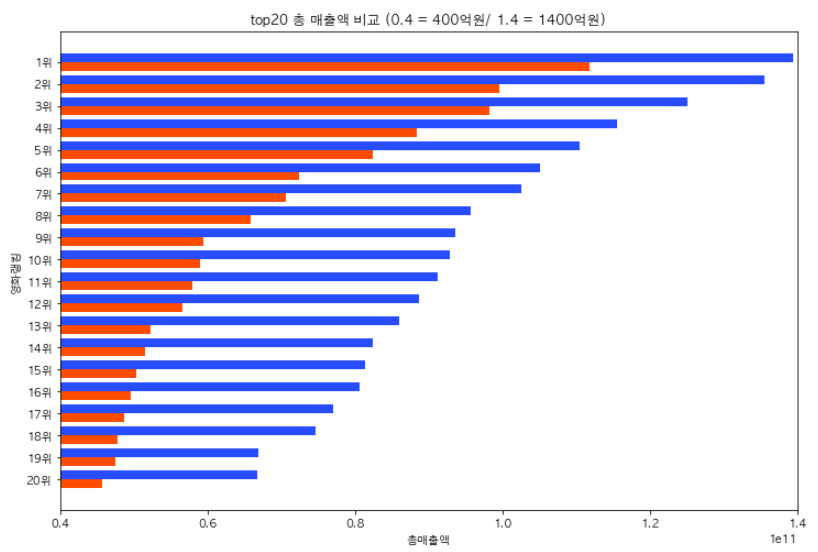
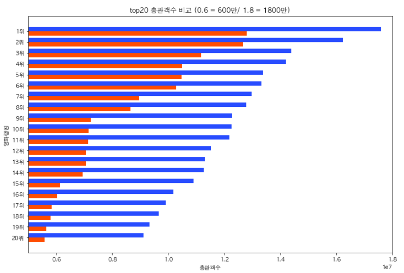
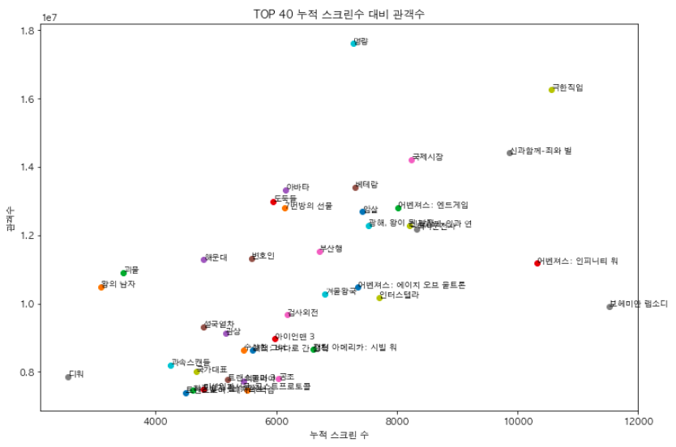
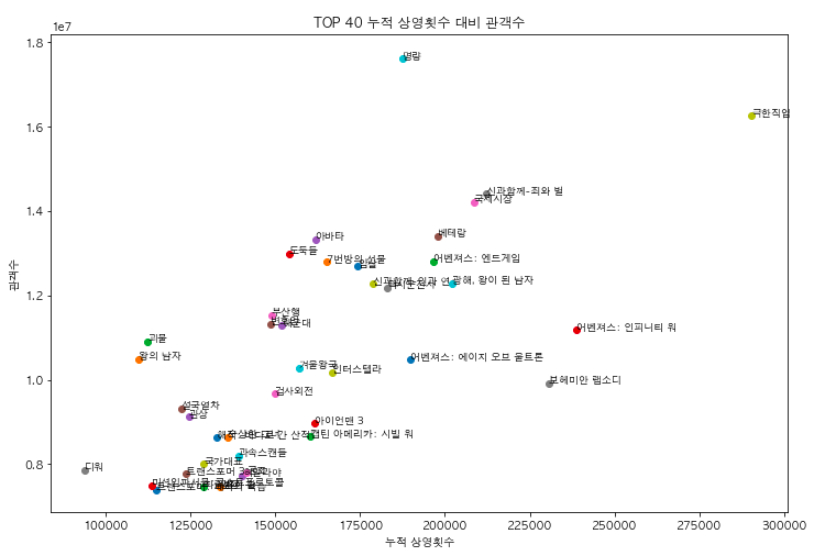

Movie Data Analysis Project 
===========================
## 1. Topic : Will movies with original works be more successful?
Comparison between the movies with original works and without it. 

## 2. Hypothesis : Movies with original works will be more successful

## 3. Data for analysis
1. Total sales of movies 
2. The number of audience 
3. Total number of audience compared to the number of screens and total number of audience compared to the number of screenings.
## 4. The result of data analysis
Blue = Movies without originals 
Red = Movies with originals 
### 1. Compariosn between top 20 of total sales 

 x = Total sales 
y = Top 20 movies for each
### 2. Compariosn between top 20 of the total number of audience 

 x = Total number of audience 
y = Top 20 movies for each 
### 3. Total number of audience compared to the number of screens 

 x = The number of screens 
y = Total number of audience 
### 4. Total number of audience compared to the number of screenings 

 x = The number of screenings 
y = Total number of audience 
## 5. Result
### Movies without original works are more successful.
All the data is from wikipedia and [KOFIC](http://www.kobis.or.kr/kobisopenapi/homepg/main/main.do)
